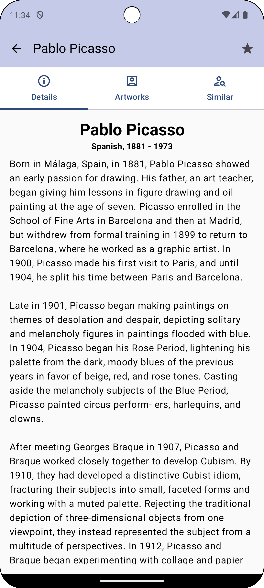
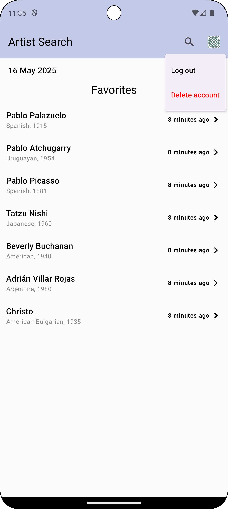

# 🖼️ ArtsySearchApp

ArtsySearchApp is a modern Android application built using **Jetpack Compose** that allows users to search for artists and explore detailed information, artworks, and categorized styles powered by the **Artsy API**.




---

## ✨ Features

- 🔍 **Search Artists** by name with real-time results
- 📄 **Artist Detail View** with biography, birthday, nationality
- 🖼️ **Artwork Categories** shown in a beautiful card carousel
- ⭐ **Favorites Support** for logged-in users
- 🎨 Responsive UI with support for light & dark themes
- 🍪 Authenticated sessions via JWT cookies
- 🧭 Modular navigation using Jetpack Compose Navigation
- 💉 Dependency injection using Hilt
- 📱 Built with modern Android architecture principles

---

## 🏗️ Project Structure

com.pri.artsysearchapp/
├── common/        # Shared utils and constants
├── data/          # API models and repository layer
├── di/            # Dependency injection setup
├── ui/            # Screens and UI components
├── App.kt         # Root composable and theme wrapper
├── AppNavigation.kt  # Navigation graph using Compose
├── MainActivity.kt   # Entry point for the app
├── Utilities.kt      # Helper composables and methods

---

## 🖼️ Screenshots

### 🔍 Home Screen


### 🔍 Search Screen


### 🖼️ Artist Detail


### 🧭 Category Dialog


---

## 🚀 Getting Started

### ✅ Prerequisites

- Android Studio Giraffe or later
- Minimum SDK 26
- Artsy API access token

### 🔧 Setup

1. **Clone the repo**
   ```bash
   git clone https://github.com/your-username/ArtsySearchApp.git
2.	Open in Android Studio
3. Insert your Artsy API token
Add your X-Xapp-Token securely (e.g., using local.properties or Android Secrets Gradle Plugin).
4.	Run the app on an emulator or physical device.

---

## 🛠️ Built With
-	Jetpack Compose
-	Kotlin Coroutines
-	Hilt
-	Coil for image loading
-	Material 3 for UI components

---

## 🙋‍♀️ Author

Priyanka Rani

📧 Feel free to reach out via LinkedIn or submit issues/PRs for contributions!